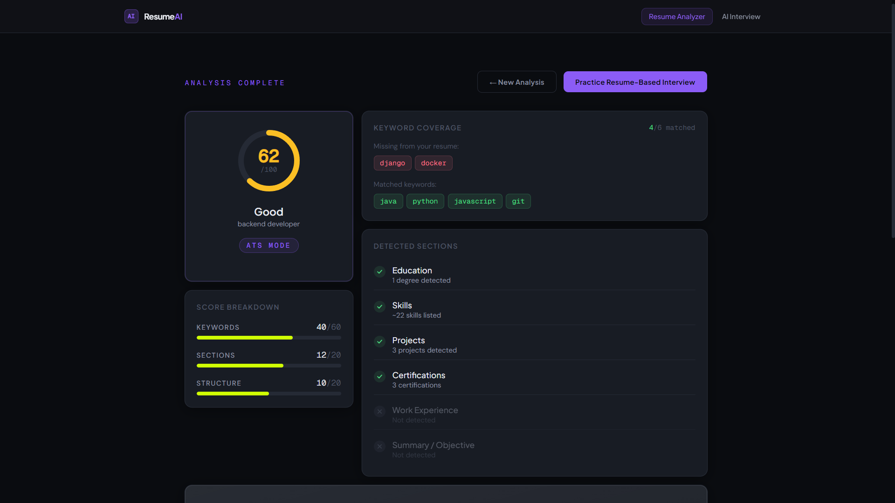
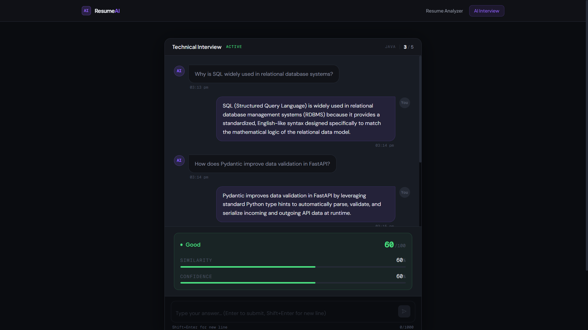
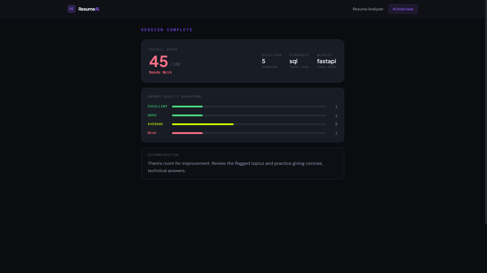

# Resume Analyzer & AI Interview Platform

An AI-powered resume analysis and interview preparation platform built using React, FastAPI, and TensorFlow-based semantic evaluation.

This project analyzes resumes, evaluates ATS compatibility, extracts skills and sections, identifies missing keywords, and generates personalized technical interview questions tailored to the candidate’s resume and target role.

---

# Features

## Resume Analysis

* ATS-style resume scoring
* Job-description-aware keyword matching
* Resume section parsing using deterministic heuristics
* Missing keyword detection
* Section-wise feedback generation
* Parser transparency and extracted text inspection

## Personalized AI Interview

* Resume-aware technical interview generation
* Target-role-aware question prioritization
* Adaptive question selection from curated datasets
* Semantic answer evaluation
* Confidence-aware scoring pipeline
* Real-time interview feedback
* Interview performance summary

## UI / UX

* Modern glassmorphism-inspired interface
* Responsive layout
* Interactive interview chat interface
* Animated score indicators
* Hover interactions and smooth transitions
* Auto-focused chat experience

---

# Tech Stack

## Frontend

* React
* TypeScript
* Tailwind CSS
* React Router

## Backend

* FastAPI
* Python
* Pydantic

## AI / ML

* TensorFlow
* TensorFlow Hub
* Universal Sentence Encoder
* scikit-learn

## Database

* SQLite

---

# System Architecture

## Resume Analysis Pipeline

1. Resume PDF Upload
2. Text Extraction
3. Text Cleaning & Normalization
4. Section Detection
5. Skill Extraction
6. ATS Keyword Matching
7. Section-wise Scoring
8. Feedback Generation

---

## Interview Pipeline

1. Resume Skills Extraction
2. Job Description Parsing
3. Topic Mapping
4. Curated Question Selection
5. Candidate Answer Evaluation
6. Semantic Similarity Scoring
7. Confidence Penalty Analysis
8. Final Interview Summary

---

# Key Features Explained

## Resume Section Parser

The parser uses deterministic regex and heuristic-based detection instead of black-box ML.

Detected sections include:

* Summary
* Experience
* Education
* Projects
* Skills
* Certifications

The parser also computes:

* Number of projects
* Experience entries
* Certifications count
* Skills count

---

## ATS Keyword Matching

The analyzer compares:

* resume keywords
* extracted skills
* target role requirements

against the job description to identify:

* matched keywords
* missing keywords
* optimization opportunities

---

## Personalized AI Interview

The interview system generates questions based on:

* extracted resume skills
* target role
* technical stack
* matched job description keywords

Example focus areas:

* React
* FastAPI
* TensorFlow
* DSA
* SQL
* Machine Learning

---

## Semantic Answer Evaluation

Candidate responses are evaluated using semantic similarity rather than exact keyword matching.

Evaluation metrics include:

* similarity score
* confidence score
* final weighted score
* answer quality classification

Quality labels:

* Excellent
* Good
* Average
* Weak

---

# Screenshots

## Resume Analysis



## AI Interview Interface



## Interview Summary



---

# Local Setup

## Clone Repository

```bash
git clone https://github.com/DebbyGHub/resume-analyzer.git
cd resume-analyzer
```

---

## Backend Setup

```bash
cd backend

python -m venv venv

# Windows
venv\Scripts\activate

pip install -r requirements.txt

uvicorn backend.app.main:app --reload
```

Backend runs at:

```bash
http://127.0.0.1:8000
```

---

## Frontend Setup

```bash
cd frontend

npm install

npm run dev
```

Frontend runs at:

```bash
http://localhost:5173
```

---

# Future Improvements

* Interview session persistence
* Adaptive follow-up questioning
* Advanced analytics dashboard
* LLM-enhanced interview mode
* Authentication & user accounts
* Cloud deployment
* Interview history tracking
* Voice-based interview simulation

---

# Learning Outcomes

This project helped me explore:

* frontend architecture with React + TypeScript
* FastAPI backend structuring
* semantic similarity evaluation
* heuristic NLP systems
* ATS optimization logic
* state management
* UI/UX design systems
* ML integration into production-style applications

---

# Author

Debadrita Chowdhury

Built as a full-stack AI-focused portfolio project combining:

* resume intelligence
* semantic evaluation
* interview preparation
* modern frontend engineering

---
